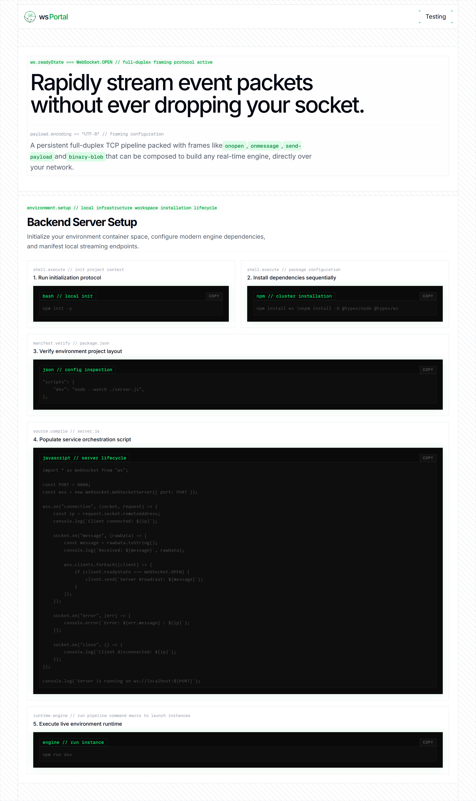
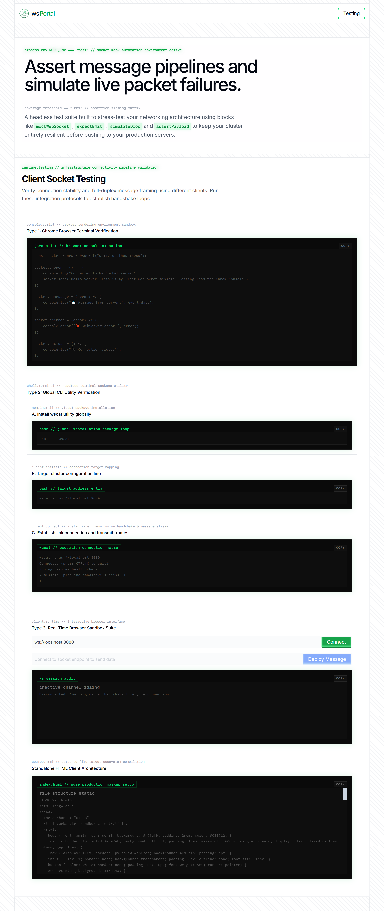

<div align="center">

# ⚡ wsPortal

**A minimal full-duplex WebSocket playground — server, client, and a built-in testing console.**

Stream event packets without ever dropping your socket.

</div>

<p align="center">
  
</p>

---

## Overview

**wsPortal** is a small, focused project for learning and prototyping with raw WebSockets. It pairs a tiny Node.js broadcast server with a React + Tailwind front end that lets you connect, send, and inspect WebSocket traffic in real time — no extra protocol layers, just `ws.send()` and `ws.onmessage`.

It also ships with a **Testing** page that documents and demonstrates four different ways to connect to the server, so you can verify your socket layer from the browser console, the CLI, or a fully interactive in-app sandbox.

## Features

- 🔌 **Live connect/disconnect UI** — type a `ws://` URL and watch the handshake happen
- 📡 **Broadcast server** — every message sent is rebroadcast to all connected clients
- 🖥️ **Terminal-style session inspector** — a glowing, monospace audit log of every event (`SYSTEM`, `NETWORK`, `INBOUND`, `OUTBOUND`, `ERROR`)
- 🧪 **Four testing surfaces** — Chrome console script, `wscat` CLI walkthrough, in-app sandbox, and a standalone HTML client
- 🎨 **"Terminal Glow" design system** — blueprint-grid gutters, dashed dividers, and neon-green terminal accents built entirely with Tailwind
- 📋 **One-click copy** on every code block via the reusable `InspectorBox` component

<p align="center">
  
</p>

## Tech Stack

| Layer | Technology |
|---|---|
| Server | Node.js, [`ws`](https://www.npmjs.com/package/ws) |
| Client | React, TypeScript, Vite |
| Styling | Tailwind CSS, `class-variance-authority`, `tailwind-merge` |
| Routing | `react-router-dom` |

## Project Structure

```
web-sockets/
├── server/
│   └── server.js          # WebSocket broadcast server (port 8080)
└── client/
    ├── src/
    │   ├── components/
    │   │   ├── common/    # InspectorBox, SectionHeader, Separator, SetupStep
    │   │   ├── home/      # Hero, EnvironmentSetup
    │   │   ├── layouts/   # Header
    │   │   └── testing/   # BrowserSandbox, CLITerminalClient, BrowserClientTesting, Hero
    │   ├── routes/        # Home, Testing
    │   └── lib/utils.ts
    └── vite.config.ts
```

## Getting Started

### 1. Start the server

```bash
cd server
npm init -y
npm install ws
node --watch server.js
```

The server listens on **`ws://localhost:8080`** and broadcasts every incoming message to all connected clients.

### 2. Start the client

```bash
cd client
npm install
npm run dev
```

Open the printed local URL in your browser. You'll land on the **Home** page with setup instructions; head to **`/testing`** for the live connection console.

## Testing the Socket

The `/testing` route walks through four ways to verify your connection:

| # | Method | Where |
|---|---|---|
| 1 | Paste a script into the Chrome DevTools console | Any browser |
| 2 | Install [`wscat`](https://www.npmjs.com/package/wscat) globally and connect via CLI | Terminal |
| 3 | Use the built-in connect/send/inspect UI | In-app sandbox |
| 4 | Open a single self-contained HTML file | Anywhere, no build step |

Each method is documented inline with copyable code blocks in the app itself.

## Roadmap

- [ ] Room/channel-based broadcasting
- [ ] Reconnect with exponential backoff
- [ ] Message history persistence
- [ ] Auth handshake example

## License

MIT — use it, fork it, break your sockets responsibly.

---

<p align="center"><sub>Built for learning real-time, full-duplex communication — one frame at a time.</sub></p>
